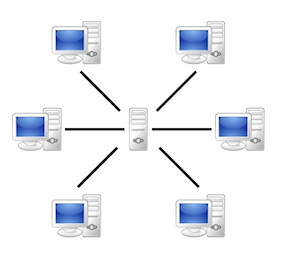
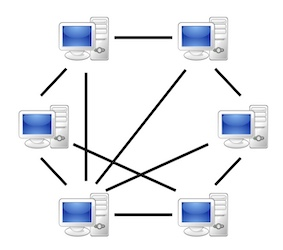
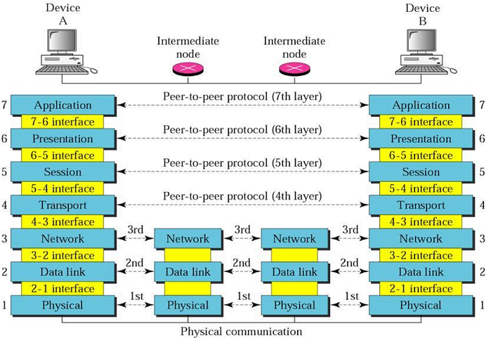

class: center, middle

# Многонишково програмиране с Java (част II)

13.12.2024

---

### Предната лекция говорихме за:

- Concurrent и паралелно изпълнение на програми
- Многонишково програмиране (Multithreading)
    - Нишки и техния жизнен цикъл
    - Атомарни типове данни
    - Комуникация и синхронизиране между нишки

---

### Днес ще разгледаме:

- Thread pools & Executors API
- Concurrent колекции
- Мрежово програмиране (част I)

---

### Runnable vs. Callable

```java
// java.lang
@FunctionalInterface
public interface Runnable {

    void run();

}

// java.util.concurrent
@FunctionalInterface
public interface Callable<V> {

    V call() throws Exception;

}
```

---

### Future<V>

```java
// java.util.concurrent
// A Future represents the result of an asynchronous computation
public interface Future<V> {

    boolean cancel(boolean mayInterruptIfRunning);

    boolean isCancelled();

    boolean isDone();

    V get() throws InterruptedException, ExecutionException;

    V get(long timeout, TimeUnit unit)
        throws InterruptedException, ExecutionException,
               TimeoutException;

}
```

---

### Преизползване на нишки

---

### Thread pool

- Kонцепция в многонишковото програмиране, при която "рециклираме" нишките, т.е. използваме ги многократно, с цел оптимизация.
- Отделните `Runnable` или `Callable` обекти се третират като "задачи" и се трупат в опашка, и когато има свободни нишки в pool-а, те изпълняват задачите, на базата на зададени правила.

.center[]

---

### Executors API: `Executor`, `ExecutorService`, `ScheduledExecutorService`

```java
// java.util.concurrent.Executor

void execute(Runnable command)

// java.util.concurrent.ExecutorService
// Добавя възможност и за изпълнение на Callable обекти,
// които, за разлика от Runnable, могат да върнат резултат

<T> Future<T> submit(Callable<T> task)

// java.util.concurrent.ScheduledExecutorService  
// Задачите могат да се пускат след определено закъснение
// или периодично на зададен интервал

ScheduledFuture<?> schedule(Runnable r, long delay, TimeUnit tu)
ScheduledFuture<?> scheduleAtFixedRate(Runnable r, long initialDelay, long period, TimeUnit tu)
ScheduledFuture<?> scheduleWithFixedDelay(Runnable r, long initialDelay, long delay, TimeUnit tu)
```

---

### Създаване на Executor, работещ с платформени нишки

```java
// предоставя статични factory методи за създаването на pools от нишки
java.util.concurrent.Executors

// pool-ът ще се състои само от една нишка, следователно
// задачите ще се изпълняват последователно
static ExecutorService newSingleThreadExecutor()

// създава pool, който ще се състои от фиксиран брой нишки.
// Ако в опашката има повече задачи, отколкото налични нишки,
// задачите не се обработват, докато не се освободи нишка
static ExecutorService newFixedThreadPool(int n)

// създава pool от нишки, който ще преизползва нишките,
// ако има налични, в противен случай ще направи нова.
// Нишките, които не се използвани през последната минута,
// ще бъдат премахнати
static ExecutorService newCachedThreadPool()

// pool, който изпълнява задачи периодично или със закъснение
static ScheduledExecutorService newScheduledThreadPool(int size)
```

---

### Създаване на Executor, работещ с виртуални нишки (от Java 21)

```java
// предоставя статични factory методи за създаването на pools от нишки
java.util.concurrent.Executors

// създава Executor, който стартира нова виртуална нишка за всяка задача
static ExecutorService newVirtualThreadPerTaskExecutor()
```
<br>

За разлика от платформените нишки, виртуалните нишки са "леки" и бързи за създаване и не е необходимо да ги "рециклираме", т.е. съхраняваме в thread pool.

<br>

```java
Executors.newVirtualThreadPerTaskExecutor();

Executors.newThreadPerTaskExecutor(Thread.ofVirtual().factory()); // еквивалентно на горното
```

---

### Спиране на Thread pool

Executor обект винаги трябва да бъде спрян с метода `shutdown()`, когато повече няма да се ползва. Това може да стане

- експлицитно, с извикване на метода му `shutdown()`
- (от Java 19) имплицитно, чрез декларирането на `ExecutorService` инстанцията в try-with-resources, тъй като е `AutoCloseable` и при имплицитното извикване на `close()` ще се извика `shutdown()`

---

### Thread-safe колекции: Синхронизирани колекции

- Collections API предоставя имплементации на няколко синхронизирани колекции като `
Vector` и `Hashtable`
- `java.util.Collections` предоставя factory метод, с който можем да създадем synchronized колекция от съществуваща обикновена колекция
- Синхронизираните колекции обаче не са достатъчно бързи при много едновременни ползватели и не предоставят възможност за атомарни операции

<br>

```java
static <T> Collection<T> synchronizedCollection(Collection<T> c)
```

---

### Thread-safe колекции: Concurrent колекции

- намират се в пакета `java.util.concurrent`
- създадени са специално за работа в concurrent среда
- добавят възможности за
    - Lock-free паралелен достъп
    - Fail-safe итератори
    - Атомарни операции (например, `putIfAbsent()`)

---

### `CopyOnWriteArrayList`

- Алтернатива на синхронизираните имплементации на `ArrayList`
- Позволява lock-free паралелно четене
- "Fail-safe snapshot" итератор
- Всяка модификация предизвиква копиране на масива
- Атомарни операции: `boolean addIfAbsent(E e);`
- Използването на тази структура е подходящо, само когато броят на четенията от масива значително надвишава броя на модификациите. В противен случай, структурата е изключително неефективна

---

### `ConcurrentHashMap`

- Алтернатива на синхронизираните версии на `java.util.HashMap`
- Паралелен lock-free достъп за четене
- Паралелен (но лимитиран) достъп за писане 
- Fail-safe и "Weakly consistent" итератор
- Атомарни операции: `V putIfAbsent(K key, V value)`
- Най-популярната колекция от `java.util.concurrent` библиотеката, почти винаги е подходяща да се използва за замяната на старите синхронизирани варианти на `HashMap`

---

### `BlockingQueue<E>`

Интерфейс на блокираща опашка ("Producer-Consumer" опашка).
Извикването на някои нейни методи може да блокира съответната нишка, когато опашката:
- е празна и се опитваме да вземем елемент от нея. При добавяне на елемент, евентуални чакащи нишки биват отблокирани
- е пълна и се опитваме да добавим елемент в нея. При премахване на елемент, евентуални чакащи нишки биват отблокирани

---

### `BlockingQueue<E>`

Основни имплементации:

- `ArrayBlockingQueue<Е>` – пази елементите си в масив. Не може да се resize-ва.
- `LinkedBlockingQueue<E>` – пази елементите си в свързан списък. Може да се конструира с фиксиран или динамичен размер. Обикновено има по-висок throughput от опашките, базирани на масиви, но и по-непредвидим performance.

<br>

```java
BlockingQueue<Order> queue = new ArrayBlockingQueue<>(100);
```

---

### Java concurrency utilities: Обобщение

- Atomic data types
- Task scheduling framework (Executors)
- Concurrent collections
- Fork/join framework (`ForkJoinPool`, *work stealing*)
- Synchronizers: Semaphores, Latches, Barriers, Phasers, Exchangers
- Locks (`java.util.concurrent.locks`)
- Nanosecond-granularity timing (`System.nanoTime()`)

---

### Полезни четива

- [Virtual Threads in Java (Project Loom)](https://www.happycoders.eu/java/virtual-threads/)
- [The Ultimate Guide to Java Virtual Threads](https://blog.rockthejvm.com/ultimate-guide-to-java-virtual-threads/)

---

### Полезни четива

.center[]

---

### Теория vs. практика

.center[]

---

class: center, middle

# Мрежово програмиране с Java

13.12.2024

.center[]

---

### Теми, които ще разгледаме

- Мрежови модели: клиент-сървър, peer-to-peer
- Мрежови протоколи
    - IP, UDP, TCP
- Мрежова комуникация в Java
    - blocking
    - non-blocking
- Network scalability

---

### Модел Клиент-Сървър

*Клиент-сървър* е разпределен изчислителен модел, при който част от задачите се разпределят между доставчиците на ресурси или услуги, наречени *сървъри* и консуматорите на услуги, наречени *клиенти*.

<br>

.center[]

---

### Модел Peer-to-peer

*Peer-to-peer* е разпределен архитектурен модел на приложение, при който задачите се разпределят по еднакъв начин между всички участници (peer, node). Всеки участник е едновременно и клиент, и сървър.

.center[]

---

### Видове клиенти

- Според наличната функционалност в клиента:
    - Rich клиенти
    - Thin клиенти
- Според семантиката (протокола):
    - Web клиенти – Браузъри (Chrome, Firefox, IE).
    - Mail клиенти – POP/SMTP клиенти (MS Outlook, Lotus notes).
    - FTP клиенти – Total Commander, Filezilla, WinSCP.
    - ...

---

### Видове сървъри

- Файл сървър (Windows, Samba, UNIX NFS, OpenAFS)
- DB сървър (MySQL, PostgreSQL, Oracle, MS SQL Server, Mongo DB)
- Mail сървър (MS Exchange, GMail)
- Name сървър (DNS)
- FTP сървър (ftpd, IIS)
- Print сървър
- Game сървър
- Web сървър (Apache, GWS, MS IIS, nginx)
- Application сървър (Tomcat, TomEE, GlassFish, JBoss)
- ...

---

### Предимства и недостатъци на Клиент-Сървър

- Висока сигурност: контролът за достъп до данните се осъществява на едно място: сървъра
- Консистентност на данните: всички клиенти в даден момент достъпват едни и същи данни
- Промени в данните се разпространяват много бързо в мрежата: при първото извикване от клиент към сървъра
- Single Point Of Failure (SPOF): ако сървърът е down, никой в мрежата не може да комуникира
- Увеличаването на броя на клиентите води до намаляване на производителността
- 70-95% от времето, през което работи, сървърът е... *idle*

---

### Предимства и недостатъци на Peer-to-Peer

- Няма SPOF
- Няма намаляване на производителността при увеличаване на броя на клиентите
- Проблеми със сигурността: има копия на даните из цялата мрежа
- Риск от умишлена промяна (подмяна) на съдържанието и различни версии на данните в различни възли на мрежата
- Липса на контрол върху съдържанието и възможност за загуба на съдържание
- Труден процес на поддръжка

---

### Open Systems Interconnection (OSI) модел

.center[]

---

### OSI модел: мрежови протоколи

<table style="font-size:0.7em; line-height=0.3em;">
  <tr>
    <th style="font-weight: bold; padding-right: 12px; font-weight: bold;">#</th>
    <th style="font-weight: bold;">Слой</th>
    <th style="font-weight: bold;">Описание</th>
    <th style="font-weight: bold;">Протоколи</th>
  </tr>
  <tr>
    <td>7</td>
    <td>Application</td>
    <td>Позволява на потребителските приложения да заявяват услуги или информация, а на сървър приложенията — да се регистрират и предоставят услуги в мрежата.</td>
    <td>DNS, FTP, HTTP, NFS, NTP, DHCP, SMTP, Telnet</td>
  </tr>
  <tr>
    <td>6</td>
    <td>Presentation</td>
    <td>Конвертиране, компресиране и криптиране на данни.</td>
    <td>TLS/SSL</td>
  </tr>
  <tr>
    <td>5</td>
    <td>Session</td>
    <td>Създаването, поддържането и терминирането на сесии. Сигурност. Логически портове.</td>
    <td>Sockets</td>
  </tr>
  <tr>
    <td>4</td>
    <td>Transport</td>
    <td>Грижи се за целостта на съобщенията, за пристигането им в точна последователност, потвърждаване за пристигане, проверка за загуби и дублиращи се съобщения.</td>
    <td>TCP, UDP</td>
  </tr>
  <tr>
    <td>3</td>
    <td>Network</td>
    <td>Управлява пакетите в мрежата. Рутиране. Фрагментация на данните. Логически адреси.</td>
    <td>IPv4, IPv6, IPX, ICMP</td>
  </tr>
  <tr>
    <td>2</td>
    <td>Data Link</td>
    <td>Предаване на фреймове от един възел на друг. Управление на последователността на фреймовете. Потвърждения. Проверка за грешки. MAC.</td>
    <td>ATM, X.25, DSL, IEEE 802.11</td>
  </tr>
  <tr>
    <td>1</td>
    <td>Physical</td>
    <td>Отговаря за предаването и приемането на неструктурирани потоци от данни по физическия носител. Кодиране/декодиране на данните. Свързване на физическия носител.</td>
    <td>IEEE 802.11, IEEE 1394, Bluetooth</td>
  </tr>
</table>


---

### `java.net` | Въведение

Пакетът `java.net` предоставя класове, които използват и работят на различни нива от OSI модела.

- Мрежов и data link слой
    - класът `NetworkInterface` предоставя достъп до мрежовите адаптери на компютъра
    - IP адреси - класът `InetAddress`
- Транспортен слой
    - TCP - класове `Socket` и `ServerSocket`
    - UDP - класове `DatagramPacket`, `DatagramSocket` и `MulticastSocket`
- Приложен слой
    - класовете `URL` и `URLConnection` за достъпването на HTTP и FTP ресурси
    - (от Java 11) класовете от пакета `java.net.http` за по-удобна работа с HTTP

---

### `java.net` | Мрежови адаптери

- Мрежовият адаптер осъществява връзката между компютърна система и мрежа
- Мрежовите адаптери могат да бъдат физически или виртуални (софтуерни). Примери за виртуални са *loopback* интерфейсът и интерфейсите, създадени от виртуалните машини
- Една система може да има повече от един физически и/или виртуален мрежови адаптер
- Java предоставя достъп до всички мрежови адаптери чрез класа `java.net.NetworkInterface`

---

### IP адрес

- Всеки компютър, свързан към мрежа, се идентифицира с логически адрес
- Най-разпространените протоколи за логически адреси в мрежата са IP (Internet Protocol) версия 4 и IP версия 6
- Адресите в IPv4 представляват 32-битови числа, а в IPv6 - 128-битови

<br>

.center[]

---

### Портове

- В общия случай, компютърът има една физическа връзка към мрежата. По тази връзка се изпращат и получават данни от/за всички приложения. Портовете се използват, за да се знае, кои данни за кое приложение са
- Предадените данни по мрежата винаги съдържат в себе си информация за компютъра и порта, към които са насочени
- Портовете се идентифицират с 16-битово число, което се използва от UDP и TCP протоколите, за да идентифицират за кое приложение са предназначени данните
- Портовете могат да бъдат от номер 0 до номер 65 535
- Портове с номера от 0 до 1023 са известни като *well-known ports*. За да се използват тези портове от вашето приложение, то трябва да се изпълнява с администраторски права

---

### Адресиране в мрежата | `java.net.InetAddress`

- Инстанции се създават чрез статични методи на класа
- С `NetworkInterface`, може да вземете списък с всички мрежови адаптери или точно определен

```java
// създава инстанция по hostname или по текстово представяне на IP адрес
InetAddress address = InetAddress.getByName​("www.google.com");
System.out.println(address.getHostAddress()); // 172.217.169.164

InetAddress address = InetAddress.getByName("62.44.101.138");
System.out.println(address.getHostName()); // www.fmi.uni-sofia.bg
System.out.println(address.isReachable(5_000)); // true
InetAddress localhost = InetAddress.getLocalHost();

Collections.list(NetworkInterface.getNetworkInterfaces())
           .stream()
           .forEach(n -> {
                System.out.println("Disp. name: " + n.getDisplayName());
                System.out.println("Name: " + n.getName());
           });
```

---

### Сокети (sockets)

- UDP и TCP се имплементират чрез *сокети* (*sockets*)
- Сокетите представляват крайните точки на двупосочна мрежова връзка (connection) между две приложения
- Всеки сокет се идентифицира чрез комбинация от IP адрес и номер на порт

---

### UDP протокол

- позволява на приложенията да пращат съобщения, наречени *datagrams*, чрез прост, connection-less модел на комуникация
- няма *handshake* между двете страни на комуникацията, в следствие на което няма гаранция за доставка на съобщенията и за запазване на реда им

---

### UDP протокол

- Datagram се представя от класа `java.net.DatagramPacket`
- `DatagramSocket` представлява connection-less сокет за пращане и получаване на datagram пакети чрез методите си `send` и `receive`

---

### TCP протокол

- Надгражда IP протокола, затова също се нарича TCP/IP ("TCP over IP")
- Предава данните по надежден начин, т.е. с проверка за грешки, с гаранция за доставка и със запазване на реда на пакетите

---

### TCP протокол

- Имплементира се със сокети - класовете `ServerSocket` и `Socket`, позволяващи пращането и получаването на съобщения между две приложения: сървър и клиент

---

### TCP vs. UDP

| Характеристика               | TCP                  | UDP                       |
|:-----------------------------|:---------------------|:--------------------------|
| Connection                   | connection-based     | connection-less           |
| Надеждност                   | висока               | ниска                     |
| Ред на пакетите              | гарантиран           | не гарантиран             |
| Скорост на доставка          | по-ниска от UDP      | по-висока от TCP          |
| Проверка за грешки           | да, с възстановяване | да, но без възстановяване |
| Потвърджаване при получаване | да                   | не                        |

---

###  To be continued...

---

## Въпроси?

.font-xl[.ri-github-fill.icon-inline[[fmi/java-course](https://github.com/fmi/java-course)]]

.font-xl[.ri-youtube-fill.icon-inline[[MJT2025](https://www.youtube.com/playlist?list=PLew34f6r0Pxyldqe31Txob2V3M3m1MKCn)]]
